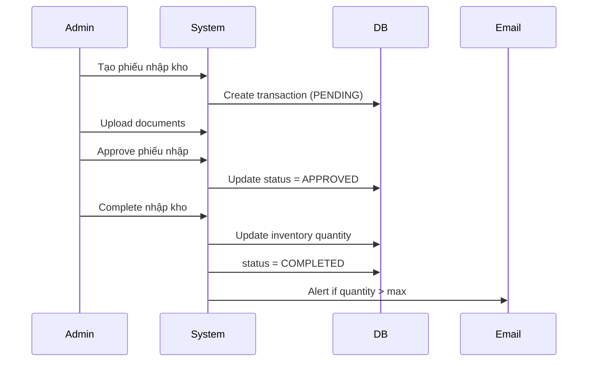

# 📦 Inventory Management System - Complete Documentation

## 🎯 Overview
Hệ thống **Quản lý Xuất Nhập Kho** (Inventory Management) cho HealthAI App được thiết kế để quản lý toàn bộ chu trình kho hàng từ nhập → xuất → chuyển kho → kiểm kê.

---

## 📊 Database Schema (4 New Tables)

### 1. **warehouses** - Quản lý Kho Hàng
| Column | Type | Description |
|--------|------|-------------|
| `id` | UUID | Primary key |
| `code` | VARCHAR(50) | Mã kho (WH-HN-01, WH-HCM-02) |
| `name` | VARCHAR(255) | Tên kho (Kho Trung Tâm Hà Nội) |
| `type` | VARCHAR(50) | CENTRAL, REGIONAL, RETAIL |
| `address` | TEXT | Địa chỉ kho |
| `city` | VARCHAR(100) | Thành phố |
| `manager_name` | VARCHAR(255) | Tên quản lý kho |
| `manager_phone` | VARCHAR(20) | SĐT quản lý |
| `capacity` | INTEGER | Sức chứa tối đa (đơn vị sản phẩm) |
| `is_active` | BOOLEAN | Trạng thái hoạt động |
| `created_at` | TIMESTAMP | Ngày tạo |

**Indexes:**
```sql
CREATE UNIQUE INDEX idx_warehouses_code ON warehouses(code);
CREATE INDEX idx_warehouses_city ON warehouses(city);
CREATE INDEX idx_warehouses_type ON warehouses(type);
```

---

### 2. **inventory_items** - Tồn Kho Chi Tiết
| Column | Type | Description |
|--------|------|-------------|
| `id` | UUID | Primary key |
| `product_id` | UUID | FK → products |
| `warehouse_id` | UUID | FK → warehouses |
| `quantity` | INTEGER | Tồn kho hiện tại |
| `reserved_quantity` | INTEGER | Số lượng đang đặt trước (giỏ hàng) |
| `available_quantity` | INTEGER | COMPUTED: quantity - reserved_quantity |
| `min_stock_level` | INTEGER | Ngưỡng cảnh báo tồn kho thấp |
| `max_stock_level` | INTEGER | Ngưỡng tồn kho tối đa |
| `reorder_point` | INTEGER | Điểm đặt hàng lại tự động |
| `last_restock_date` | TIMESTAMP | Lần nhập hàng gần nhất |

**Business Rules:**
- `available_quantity = quantity - reserved_quantity`
- Khi `quantity ≤ min_stock_level` → Alert LOW_STOCK
- Khi `quantity ≤ reorder_point` → Auto create Purchase Order
- Unique constraint: `(product_id, warehouse_id)`

**Indexes:**
```sql
CREATE UNIQUE INDEX idx_inventory_product_warehouse ON inventory_items(product_id, warehouse_id);
CREATE INDEX idx_inventory_low_stock ON inventory_items(quantity) WHERE quantity <= min_stock_level;
```

---

### 3. **inventory_transactions** - Lịch Sử Xuất Nhập Kho
| Column | Type | Description |
|--------|------|-------------|
| `id` | UUID | Primary key |
| `transaction_code` | VARCHAR(50) | Mã phiếu (IN-2025-001, OUT-2025-002) |
| `inventory_item_id` | UUID | FK → inventory_items |
| `warehouse_id` | UUID | FK → warehouses |
| `transaction_type` | VARCHAR(50) | IN, OUT, TRANSFER, ADJUSTMENT, RETURN |
| `quantity` | INTEGER | Số lượng (dương = nhập, âm = xuất) |
| `quantity_before` | INTEGER | Tồn kho trước giao dịch |
| `quantity_after` | INTEGER | Tồn kho sau giao dịch |
| `reason` | TEXT | PURCHASE_ORDER, CUSTOMER_ORDER, DAMAGE, EXPIRED, TRANSFER |
| `reference_id` | UUID | ID tham chiếu (order_id, etc.) |
| `reference_type` | VARCHAR(50) | ORDER, TRANSFER, ADJUSTMENT |
| `from_warehouse_id` | UUID | Kho nguồn (cho TRANSFER) |
| `to_warehouse_id` | UUID | Kho đích (cho TRANSFER) |
| `unit_cost` | DECIMAL(12,2) | Giá nhập/xuất đơn vị |
| `total_cost` | DECIMAL(12,2) | Tổng giá trị |
| `notes` | TEXT | Ghi chú |
| `created_by` | UUID | FK → users |
| `approved_by` | UUID | FK → users |
| `status` | VARCHAR(50) | PENDING, APPROVED, COMPLETED, CANCELLED |
| `created_at` | TIMESTAMP | Thời gian tạo |
| `completed_at` | TIMESTAMP | Thời gian hoàn thành |

**Transaction Types:**
1. **IN (Nhập kho):** quantity > 0, reason = PURCHASE_ORDER, RETURN
2. **OUT (Xuất kho):** quantity < 0, reason = CUSTOMER_ORDER, DAMAGE, EXPIRED
3. **TRANSFER (Chuyển kho):** Tạo 2 transactions (OUT + IN)
4. **ADJUSTMENT (Điều chỉnh):** Kiểm kê, sửa lỗi dữ liệu
5. **RETURN (Trả hàng):** Khách trả hàng, nhập lại kho

**Indexes:**
```sql
CREATE UNIQUE INDEX idx_inventory_txn_code ON inventory_transactions(transaction_code);
CREATE INDEX idx_inventory_txn_reference ON inventory_transactions(reference_id, reference_type);
CREATE INDEX idx_inventory_txn_created_at ON inventory_transactions(created_at DESC);
```

---

## 🔄 Functional Flows

### Flow 1: Nhập Kho (Stock In) - 15 Steps

```
1. Warehouse Manager tạo phiếu nhập kho
   - Input: product_id, warehouse_id, quantity, unit_cost, supplier
   - Generate transaction_code: IN-YYYY-MM-XXX

2. Hệ thống validate:
   - Product tồn tại và active
   - Warehouse đang hoạt động
   - Capacity: current_stock + new_quantity ≤ warehouse.capacity

3. Create inventory_transaction (status = PENDING)

4. Admin upload hóa đơn VAT, phiếu xuất kho NCC

5. Kiểm tra thực tế: số lượng, chất lượng, hạn sử dụng

6. QC Check (đối với thuốc/thiết bị y tế)

7. Manager phê duyệt (status = APPROVED)

8. Complete transaction (status = COMPLETED):
   - inventory_items.quantity += transaction.quantity
   - Record quantity_before, quantity_after
   - Update last_restock_date

9. Check thresholds:
   - If quantity > max_stock_level → Alert OVERSTOCK

10. Send notifications: Email + In-app (Admin, Accountant)
```

**Mermaid Diagram:**


---

### Flow 2: Xuất Kho (Stock Out) - 18 Steps

```
1. Order Service request xuất kho (order_id, items[])

2. Validate order đã thanh toán (status = CONFIRMED)

3. Check available_quantity = quantity - reserved_quantity

4. Select warehouse gần khách hàng nhất có đủ hàng

5. Reserve stock: reserved_quantity += order_quantity

6. Create OUT transaction (status = PENDING)

7. Generate pick list cho nhân viên kho

8. Warehouse staff pick items từ vị trí kho

9. Scan barcode xác nhận đúng sản phẩm

10. Quality check: chất lượng, hạn sử dụng

11. Pack items, ghi thông tin giao hàng

12. Supervisor approve phiếu xuất

13. Update inventory:
    - quantity -= order_quantity
    - reserved_quantity -= order_quantity

14. Complete transaction (status = COMPLETED)

15. Create shipment (tích hợp GHTK/GHN)

16. Check reorder point:
    - If quantity ≤ reorder_point → Auto create Purchase Order

17. Notify Order Service, send tracking info
```

---

### Flow 3: Chuyển Kho (Warehouse Transfer)

**Workflow:**
```
1. Admin tạo transfer request (from_warehouse, to_warehouse, product, quantity)

2. Check từ kho nguồn: available_quantity >= transfer_quantity

3. Tạo 2 transactions:
   - OUT transaction từ Warehouse A (status = PENDING)
   - IN transaction vào Warehouse B (status = PENDING)

4. Warehouse A chuẩn bị hàng (status = APPROVED)
   - WHFrom.quantity -= transfer_qty

5. Internal shipper vận chuyển

6. Warehouse B nhận hàng, xác nhận
   - WHTo.quantity += transfer_qty

7. Update cả 2 transactions = COMPLETED
```

---

## 📡 API Endpoints (20+ APIs)

### Warehouse Management
- `GET /api/v1/warehouses` - Danh sách kho hàng
- `POST /api/v1/warehouses` - Tạo kho mới (ADMIN)
- `GET /api/v1/warehouses/{id}` - Chi tiết kho
- `PUT /api/v1/warehouses/{id}` - Cập nhật kho
- `DELETE /api/v1/warehouses/{id}` - Vô hiệu hóa kho

### Inventory Items
- `GET /api/v1/inventory/items` - Danh sách tồn kho
- `GET /api/v1/inventory/items/{id}` - Chi tiết mục tồn kho
- `GET /api/v1/inventory/products/{productId}/stock` - Tồn kho của sản phẩm ở tất cả kho
- `POST /api/v1/inventory/items/{id}/reserve` - Đặt trước tồn kho (giỏ hàng)
- `POST /api/v1/inventory/items/{id}/release` - Giải phóng tồn kho

### Inventory Transactions
- `GET /api/v1/inventory/transactions` - Lịch sử xuất nhập kho
- `POST /api/v1/inventory/transactions/in` - Tạo phiếu nhập kho
- `POST /api/v1/inventory/transactions/out` - Tạo phiếu xuất kho
- `POST /api/v1/inventory/transactions/transfer` - Chuyển kho
- `POST /api/v1/inventory/transactions/adjustment` - Điều chỉnh tồn kho
- `PUT /api/v1/inventory/transactions/{id}/approve` - Phê duyệt phiếu
- `PUT /api/v1/inventory/transactions/{id}/complete` - Hoàn thành phiếu
- `PUT /api/v1/inventory/transactions/{id}/cancel` - Hủy phiếu

### Reports & Analytics
- `GET /api/v1/inventory/reports/stock-summary` - Báo cáo tồn kho tổng hợp
- `GET /api/v1/inventory/reports/low-stock` - Sản phẩm sắp hết hàng
- `GET /api/v1/inventory/reports/transaction-history` - Lịch sử xuất nhập
- `GET /api/v1/inventory/reports/valuation` - Báo cáo giá trị tồn kho

---

## 🔐 Business Rules

### 1. Stock Reservation (Đặt trước tồn kho)
```
- Khi user thêm vào giỏ hàng:
  → reserved_quantity += cart_quantity
  → available_quantity = quantity - reserved_quantity

- Auto-release sau 15 phút nếu không checkout

- Khi checkout thành công:
  → quantity -= cart_quantity
  → reserved_quantity -= cart_quantity
```

### 2. Low Stock Alerts
```
- Điều kiện: quantity ≤ min_stock_level
- Action: Email cảnh báo mỗi ngày 8:00 AM
- Recipients: Warehouse Manager, Purchase Manager
```

### 3. Auto Reorder
```
- Điều kiện: quantity ≤ reorder_point
- Action: Tự động tạo Purchase Order
- Quantity: (max_stock_level - current_quantity)
```

### 4. Approval Workflow
```
Phiếu cần phê duyệt khi:
- Total value > 10,000,000 VND
- Quantity > 100 units
- Transaction type = ADJUSTMENT

Approvers:
- Warehouse Manager (< 50M VND)
- Operations Director (≥ 50M VND)
```

### 5. Transfer Validation
```
- From warehouse must have: available_quantity >= transfer_quantity
- Both warehouses must be active (is_active = true)
- Product must exist in both warehouses' allowed categories
```

### 6. FIFO/FEFO Policy
```
- FIFO: First In First Out (general products)
- FEFO: First Expired First Out (medicines)
- Batch tracking: batch_number, expiry_date
```

---

## 📊 Inventory Status

| Condition | Status | Actions |
|-----------|--------|---------|
| `quantity > min_stock_level` | **AVAILABLE** | Bình thường |
| `quantity ≤ min_stock_level` | **LOW_STOCK** | Email cảnh báo |
| `quantity ≤ reorder_point` | **REORDER_NEEDED** | Auto create PO |
| `quantity = 0` | **OUT_OF_STOCK** | Ẩn khỏi Store, urgent alert |
| `quantity > max_stock_level` | **OVERSTOCK** | Alert: cân nhắc giảm giá |
| `reserved_quantity > 0` | **RESERVED** | Một phần đang được giữ |

---

## 🔄 Transaction Status Flow

```
PENDING → APPROVED → COMPLETED
   ↓          ↓
CANCELLED  CANCELLED
```

| Status | Description | Next Status |
|--------|-------------|-------------|
| **PENDING** | Phiếu mới tạo, chờ kiểm tra | APPROVED, CANCELLED |
| **APPROVED** | Đã phê duyệt, chờ thực hiện | COMPLETED, CANCELLED |
| **COMPLETED** | Hoàn thành, tồn kho đã cập nhật | - |
| **CANCELLED** | Đã hủy | - |

---

## 🎯 Key Features

### 1. Multi-Warehouse Support
- Quản lý nhiều kho: CENTRAL (trung tâm), REGIONAL (chi nhánh), RETAIL (bán lẻ)
- Tự động chọn kho gần khách nhất có đủ hàng khi xuất kho

### 2. Real-time Stock Updates
- WebSocket cho cập nhật tồn kho real-time
- Dashboard hiển thị tồn kho live cho tất cả warehouses

### 3. Barcode Scanning
- Scan mã vạch để nhập/xuất nhanh
- Xác nhận đúng sản phẩm, tránh sai sót

### 4. Batch Management
- Quản lý theo lô hàng (batch_number)
- Tracking expiry date (hạn sử dụng)
- FEFO policy cho thuốc

### 5. Location Tracking
- Vị trí lưu trữ trong kho: Rack - Shelf - Bin
- VD: R01-S03-B05 (Rack 01, Shelf 03, Bin 05)

### 6. Automated Alerts
- **LOW_STOCK:** Email khi quantity ≤ min_stock_level
- **EXPIRED:** Alert thuốc sắp hết hạn (< 3 tháng)
- **OVERSTOCK:** Alert tồn kho quá cao

### 7. Reports & Analytics
- Báo cáo tồn kho theo kho, category, thời gian
- Báo cáo xuất nhập theo ngày/tuần/tháng
- Inventory valuation (giá trị tồn kho)
- ABC Analysis (phân loại sản phẩm theo doanh thu)

### 8. System Integration
- **Order System:** Auto xuất kho khi có đơn hàng
- **Accounting:** Sync giá trị tồn kho cho báo cáo tài chính
- **Shipping:** Tích hợp GHTK, GHN để tạo vận đơn
- **Purchase:** Auto tạo PO khi tồn kho thấp

---

## 🔒 Security & Permissions

### Role-Based Access Control (RBAC)

| Role | Permissions |
|------|-------------|
| **ADMIN** | Full access: CRUD warehouses, approve all transactions |
| **WAREHOUSE_MANAGER** | Manage assigned warehouse, approve transactions < 50M |
| **WAREHOUSE_STAFF** | Create transactions, pick/pack items |
| **ACCOUNTANT** | View reports, export data |
| **SYSTEM** | Auto transactions (reserve/release stock) |

### Audit Trail
- Tất cả transactions ghi lại `created_by`, `approved_by`, `completed_by`
- Timestamp: `created_at`, `approved_at`, `completed_at`
- Immutable logs: Không được xóa/sửa sau khi COMPLETED

---

## 📈 Performance Metrics

| Metric | Target | Description |
|--------|--------|-------------|
| **Stock Accuracy** | ≥ 99% | Độ chính xác tồn kho (kiểm kê) |
| **Order Fulfillment Rate** | ≥ 95% | % đơn xuất kho thành công |
| **Stockout Rate** | ≤ 2% | % sản phẩm hết hàng |
| **Inventory Turnover** | 6-12 times/year | Vòng quay tồn kho |
| **Average Days to Restock** | ≤ 7 days | Thời gian nhập hàng từ NCC |
| **Warehouse Utilization** | 70-85% | Tỷ lệ sử dụng sức chứa kho |

---

## 🚀 Implementation Status

### ✅ Completed (October 28, 2025)

1. **Database Schema:**
   - ✅ 4 tables: warehouses, inventory_items, inventory_transactions
   - ✅ All indexes, constraints, triggers
   - ✅ ER Diagram updated

2. **API Documentation:**
   - ✅ 20+ REST API endpoints
   - ✅ Request/Response examples
   - ✅ Business rules documented

3. **Functional Flows:**
   - ✅ Stock In flow (15 steps + Mermaid diagram)
   - ✅ Stock Out flow (18 steps + Mermaid diagram)
   - ✅ Transfer flow (Mermaid diagram)
   - ✅ Status flow tables

4. **Documentation:**
   - ✅ Complete markdown documentation
   - ✅ HTML pages with navigation
   - ✅ Business rules & features

### 🔄 Next Steps (Implementation Phase)

1. **Backend Development:**
   - [ ] Spring Boot Inventory Service (Port 8009)
   - [ ] JPA Entities & Repositories
   - [ ] Service layer với business logic
   - [ ] REST Controllers
   - [ ] WebSocket for real-time updates

2. **Frontend Development:**
   - [ ] Warehouse management UI
   - [ ] Stock in/out forms
   - [ ] Inventory dashboard (real-time)
   - [ ] Reports & analytics screens

3. **Integrations:**
   - [ ] Connect với Order Service
   - [ ] Connect với Store/Pharmacy Service
   - [ ] Barcode scanner integration
   - [ ] Email notification service

4. **Testing:**
   - [ ] Unit tests (JUnit)
   - [ ] Integration tests
   - [ ] Load testing (concurrent stock updates)
   - [ ] UAT with warehouse staff

---

## 📚 Related Documentation

- **Database Schema:** `/docs/pages/database.html#warehouses`
- **API Docs:** `/docs/pages/api-docs.html#inventory`
- **Functional Flows:** `/docs/pages/functional-flows.html#inventory`
- **Architecture:** `/docs/pages/architecture.html`

---

## 📞 Contact & Support

**Team:** Inventory Management Team  
**Email:** inventory@healthai.com  
**Slack:** #inventory-system  
**Jira:** INVENTORY Project

---

**Version:** 1.0.0  
**Last Updated:** October 28, 2025  
**Author:** HealthAI Development Team
